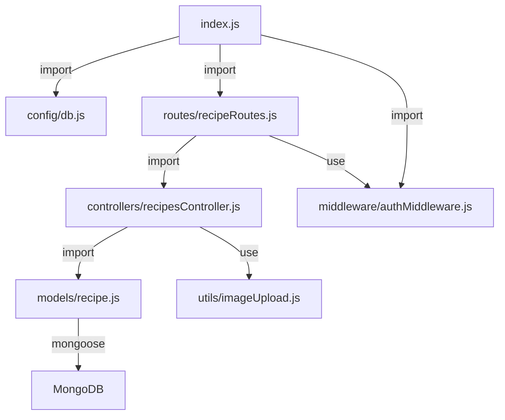

## Architecture Diagram

```mermaid
graph TD;
    index.js-->|import|config/db.js;
    index.js-->|import|routes/recipeRoutes.js;
    routes/recipeRoutes.js-->|import|controllers/recipesController.js;
    controllers/recipesController.js-->|import|models/recipe.js;
    models/recipe.js-->|mongoose|MongoDB;
    index.js-->|import|middleware/authMiddleware.js;
    routes/recipeRoutes.js-->|use|middleware/authMiddleware.js;
    controllers/recipesController.js-->|use|utils/imageUpload.js;

```